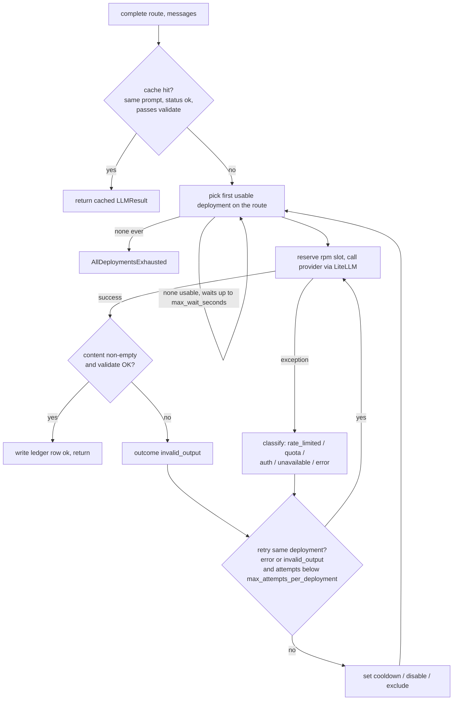

# llmrouter-free

**A quota-aware LLM failover router built for free-tier providers.**

Free-tier LLM APIs are generous and unreliable in equal measure: per-minute limits, hard daily quotas,
"temporarily overloaded" errors, models that quietly spend your whole output budget on hidden reasoning, and
responses that are valid JSON but empty. If you run a real workload (thousands of calls) on them, something
fails every few minutes, and a single-provider script stalls.

`llmrouter-free` sits between your code and [LiteLLM](https://github.com/BerriAI/litellm) and turns a list of
flaky free deployments into one dependable call:

```python
result = router.complete("default", [{"role": "user", "content": "Summarise this paper: ..."}])
print(result.text, "answered by", result.deployment)
```

It picks the first usable deployment on the route, respects each provider's rate limits *before* hitting them,
backs off correctly when they push back, fails over on errors and bad output, remembers what it already asked
(cache) and how much of each daily quota is spent (ledger), and is safe to call from many threads at once.

It was developed inside [`batterygemma`](https://github.com/fredbuildsai/batterygemma) and battle-tested there
on tens of thousands of real calls, then extracted so any project can use it.

---

## Contents
- [Features](#features) · [Install](#install) · [Quickstart](#quickstart) · [How a call works](#how-a-call-works)
- [Configuration reference](#configuration-reference) · [Python API](#python-api) · [CLI](#cli)
- [Structured output](#structured-output-json-that-is-actually-valid) · [Local models](#local-ollama-models-and-context-sizing)
- [Persistence](#persistence-ledger-cache-and-metrics) · [Concurrency](#concurrency) · [Testing](#testing-your-own-code-against-the-router)
- [Limitations](#limitations) · [Architecture docs](docs/architecture/README.md) · [Changelog](CHANGELOG.md)

## Features

| Capability | What it does |
|---|---|
| **Ordered failover** | A *route* is an ordered list of deployments; the first usable one wins, the rest are fallbacks. |
| **Rate limits, proactively** | Per-deployment `rpm` / `rpd`. Deployments that share one provider budget declare the same `rate_group` and share windows and cooldowns. |
| **Correct back-off** | `429` -> the whole rate group cools down; "daily quota" -> 24 h; transient `5xx`/timeout -> just that deployment; `401/403` or "not in your tier" -> disabled for the process. |
| **Retry the reliable one first** | Transient errors retry the *same* deployment (`max_attempts_per_deployment`) before falling to a weaker fallback. |
| **Bad output is a failure too** | Empty content, or output your `validate=` callback rejects, counts as `invalid_output` and fails over instead of being returned (or cached). |
| **Response cache** | A prior successful answer to the identical prompt is replayed, validated again, and never re-billed. |
| **Quota ledger** | Every attempt is a row in `llm_calls`; "requests used today" survives restarts. |
| **Independent judging** | `exclude_families=[...]` keeps a judge from being the same model family as the generator. |
| **Paid guard** | Paid deployments are used only with `allow_paid=True` and under `max_usd_per_day`. |
| **Local fallback** | Ollama models as the last resort, with a cap on how long to keep trying cloud first. |
| **Structured output** | `json_validator` + `json_schema_response_format` for Pydantic-typed JSON, hardened against truncated garbage. |
| **Thread-safe** | Rate-limit slots are reserved atomically; the network call itself is outside the lock. |
| **Observability** | Optional per-attempt analytics table (latency, tokens, provider ids, hardware). |

## Install

Not on PyPI yet - install straight from GitHub (pin a tag for reproducibility):

```bash
# uv (recommended)
uv pip install "git+https://github.com/fredbuildsai/llmrouter-free.git@v0.1.0"

# pip
pip install "git+https://github.com/fredbuildsai/llmrouter-free.git@v0.1.0"

# latest main
pip install "git+https://github.com/fredbuildsai/llmrouter-free.git"
```

In a `pyproject.toml`:

```toml
dependencies = ["llmrouter-free @ git+https://github.com/fredbuildsai/llmrouter-free.git@v0.1.0"]
# hatchling projects also need:  [tool.hatch.metadata]  allow-direct-references = true
```

Once published to PyPI this becomes simply `pip install llmrouter-free`. Requires Python 3.11 or 3.12.

## Quickstart

```bash
llmrouter-free init                  # writes an annotated llm_routes.yaml
# create .env with the keys you have:
#   OPENROUTER_API_KEY=sk-or-...
#   GROQ_API_KEY=gsk_...
llmrouter-free status                # which deployments are enabled, used today, cooling down
llmrouter-free test --route default --prompt "Say hi in five words."
```

Deployments whose key is missing are simply skipped, so you can start with one provider and add more.

```python
from dotenv import load_dotenv
from sqlalchemy import create_engine

from llmrouter_free import build_router, load_routes

load_dotenv()                                            # provider keys -> environment
engine = create_engine("sqlite:///router.db")            # ledger + cache (omit for a private throw-away one)
router = build_router(load_routes("llm_routes.yaml"), engine=engine)

result = router.complete(
    "default",
    [{"role": "system", "content": "You are terse."},
     {"role": "user", "content": "Name three uses of graphite."}],
    temperature=0.2,
    max_tokens=300,
)
print(result.text)
print(result.deployment, result.model, result.tokens_in, result.tokens_out, result.cached)
```

## How a call works



A deployment is **usable** when its key is set, it is not disabled or already tried, its family/model is not
excluded, it is free (or paid is allowed and budget remains), it is under its `rpd` (counted from the ledger,
summed across its `rate_group`), it is not cooling down, and its `rpm` window has room. The first usable one in
route order is taken and its rpm slot is reserved in the same locked step.

Outcomes and what each does:

| Outcome | Triggered by | Effect |
|---|---|---|
| `ok` | valid, non-empty response | cached in the ledger, returned |
| `invalid_output` | empty content, or `validate=` raised | retried on the same deployment, then failover |
| `rate_limited` | HTTP 429 | the whole `rate_group` sits out `rate_limit_seconds` |
| `quota` | 429 mentioning daily/quota limits | the group sits out `daily_quota_seconds` (24 h) |
| `error` | 5xx, timeout, connection error | this deployment sits out `error_seconds` (cleared for an immediate same-deployment retry) |
| `auth` / `unavailable` | 401/403, "not available in your subscription" | deployment disabled for the process |

## Configuration reference

`llmrouter-free init` writes a fully annotated starter; this is the complete key list.

**Top level**

| Key | Default | Meaning |
|---|---|---|
| `deployments` | required | list of deployment objects (below) |
| `routes` | required | `{route_name: [deployment names in preference order]}` |
| `cooldown.rate_limit_seconds` | 60 | group cooldown after a 429 |
| `cooldown.daily_quota_seconds` | 86400 | group cooldown after a daily-quota 429 |
| `cooldown.error_seconds` | 30 | per-deployment cooldown after a transient error |
| `max_attempts_per_call` | 6 | hard cap on attempts across all deployments for one `complete()` |
| `max_attempts_per_deployment` | 1 | tries on the same deployment for `error` / `invalid_output` before moving on |
| `max_cloud_attempts` | none | if the route contains a local (`ollama_chat/`) deployment: after this many cloud attempts, skip the remaining cloud deployments and go local. Ignored for routes with no local deployment. |
| `request_timeout_seconds` | 60 | per-HTTP-request timeout |

**Deployment**

| Key | Meaning |
|---|---|
| `name`, `model`, `api_key_env` | id, LiteLLM model id (`provider/model`), *name of the env var* holding the key |
| `tier` | `free` (default) or `paid` (needs `cost_per_mtok_in/out`; gated by `allow_paid` and `max_usd_per_day`) |
| `family` | model family, for `exclude_families` |
| `rate_group` | deployments sharing one provider budget share this id (defaults to the deployment's own name) |
| `rpm`, `rpd` | requests per minute / day on our side (omit = unlimited) |
| `api_base` | override the endpoint |
| `extra_body` | passed verbatim to the provider (e.g. `{reasoning: {enabled: false}}`, `{think: false}` for Ollama) |
| `min_max_tokens` | floor on the requested `max_tokens` (thinking models that spend budget reasoning) |
| `temperature` | overrides the caller's temperature for this deployment only |

**Environment**: provider keys are read from the environment variables you name in `api_key_env`
(`.env` is loaded by the CLI; in code call `dotenv.load_dotenv()` yourself).

## Python API

```python
router.complete(
    route, messages,
    exclude_families=(), exclude_models=(), allow_same_family_fallback=False,   # independent judging
    validate=None,            # callable(text) -> parsed | raises ValueError  (failure => invalid_output)
    temperature=0.7, max_tokens=4096,
    json_mode=False, response_format=None,     # response_format wins over json_mode
    use_cache=True, max_wait_seconds=120.0,
) -> LLMResult
```

`LLMResult`: `text`, `parsed` (whatever `validate` returned), `deployment`, `model`, `family`, `reasoning`,
`cached`, `relaxed_family`, `tokens_in`, `tokens_out`.
Raises `AllDeploymentsExhausted` when no deployment could produce a valid answer.

`router.status()` returns per-deployment rows (enabled, used today, cooldown); `router.spent_today_usd()` the
paid spend.

Constructor: `LLMRouter(config, *, engine=None, metrics_engine=None, allow_paid=False, max_usd_per_day=0.0,
completion_fn=None, clock=time.time, sleep=time.sleep)`. `completion_fn`, `clock` and `sleep` are injection
points for tests.

**Independent judge.** A judge that shares a family with the generator flatters it:

```python
answer = router.complete("default", msgs)
verdict = router.complete("judge", judge_msgs, exclude_families=[answer.family])
# if only one family is configured, opt into a same-family *different model*, flagged on the result:
verdict = router.complete("judge", judge_msgs, exclude_families=[answer.family], allow_same_family_fallback=True)
print(verdict.relaxed_family)   # True when the fallback was used
```

## CLI

```
llmrouter-free init [PATH]                     write the annotated starter config
llmrouter-free status [--config C] [--db D]    deployment table + paid spend
llmrouter-free test --route R [--prompt P]     one real call, shows who answered
```

`--config` defaults to `./llm_routes.yaml`, `--db` to `./llmrouter.db`.

## Structured output: JSON that is actually valid

```python
from pydantic import BaseModel
from llmrouter_free import json_schema_response_format, json_validator

class Extraction(BaseModel):
    materials: list[str] = []

result = router.complete(
    "default", messages,
    validate=json_validator(Extraction),                       # tolerates ```json fences, checks the schema
    response_format=json_schema_response_format(Extraction),   # schema-constrained decoding where supported
)
data: Extraction = result.parsed
```

`json_validator` also rejects a non-empty JSON object that shares *no* field with the model. That guards a
subtle failure: when every field has a default, Pydantic happily accepts a truncated `{"": "results"}` as an
empty valid object, and a response cache would then replay that garbage forever. Genuinely empty `{}` is still
accepted. Pass `strict=False` to `json_schema_response_format` for providers (e.g. Groq) that reject strict
schemas; your own validation still enforces correctness.

## Local Ollama models and context sizing

Ollama reloads the model whenever `num_ctx` changes between requests, so one static value should serve every
task. Describe your tasks and let the router size it once:

```python
from llmrouter_free import TaskBudget, build_router, load_routes

tasks = {
    "extract": TaskBudget(system_prompt=SYS, rendered_template=TMPL_WITH_EMPTY_PLACEHOLDERS,
                          output_tokens=3000, batchable=True),   # a call bundles `batch_size` items
    "judge":   TaskBudget(system_prompt=JSYS, rendered_template=JTMPL, output_tokens=800),
}
router = build_router(load_routes("llm_routes.yaml"), tasks=tasks, chunk_max_tokens=2000,
                      count_tokens=my_token_counter, batch_size=5)
```

This bakes `num_ctx = round_up(1.2 * worst_case)` into every `ollama_chat/` deployment and multiplies the
request timeout by `batch_size` (a 5-item call legitimately takes ~5x longer to generate). The same
`fits_within()` arithmetic checks a cloud model's documented window.

## Persistence: ledger, cache and metrics

- **`engine=`** (a SQLAlchemy engine) holds `llm_calls`: the quota ledger and the response cache. Point it at
  your application's database, or a dedicated file. Tables are created idempotently, so an existing
  `llm_calls` table is reused as is. Omit `engine=` for a private temp-file database that vanishes at exit.
- **`metrics_engine=`** (optional) holds `llm_call_metrics`, a wide per-attempt analytics table: latency, tokens
  in/out/reasoning, finish reason, provider response id, provider-reported model, cost, and host hardware.
  Without it, no analytics are written. Failures writing metrics never break a real call.
- Use `llmrouter_free.store.register_sqlite_pragmas(engine)` on SQLite engines: WAL + a 30 s busy timeout so
  concurrent writers queue instead of erroring.

## Concurrency

`complete()` is safe to call from many threads on one router. One lock protects the in-memory selection state
(cooldowns, disabled set, per-minute windows) and the rpm slot is reserved in the same locked step as the
choice, so two threads cannot both take the last slot. The provider call and ledger writes happen *outside* the
lock, so requests still run in parallel.

## Testing your own code against the router

Inject a fake `completion_fn` and a no-op `sleep`; nothing touches the network:

```python
def fake(**kw):
    return SimpleNamespace(
        choices=[SimpleNamespace(message=SimpleNamespace(content="ok"))],
        usage=SimpleNamespace(prompt_tokens=1, completion_tokens=1))

router = LLMRouter(config, completion_fn=fake, sleep=lambda _: None)
```

This repository's own suite (`uv run pytest`) covers failover, cooldown arithmetic, daily-quota exclusion,
caching, retry-same-deployment, thread-safety, the persistence contract and the CLI.

## Limitations

- Sits on LiteLLM's synchronous `completion`; there is no async API yet.
- Cost tracking covers only deployments that declare `cost_per_mtok_*`.
- "Daily" limits are counted from the ledger in UTC days; they assume this router is the only consumer of the key.
- Cooldown and disabled state are per-process memory (the *ledger* persists; cooldowns do not survive a restart).
- Not a proxy server: it is a library (plus a small CLI), not a network service.

## Roadmap
PyPI release, async `acomplete`, cooldown persistence, streaming, per-route default parameters.

## Development

```bash
git clone https://github.com/fredbuildsai/llmrouter-free && cd llmrouter-free
uv venv && uv pip install -e ".[dev]"
uv run pytest -q && uv run ruff check src tests
```

Architecture documentation (arc42): [docs/architecture/](docs/architecture/README.md).

## License
MIT - see [LICENSE](LICENSE).
