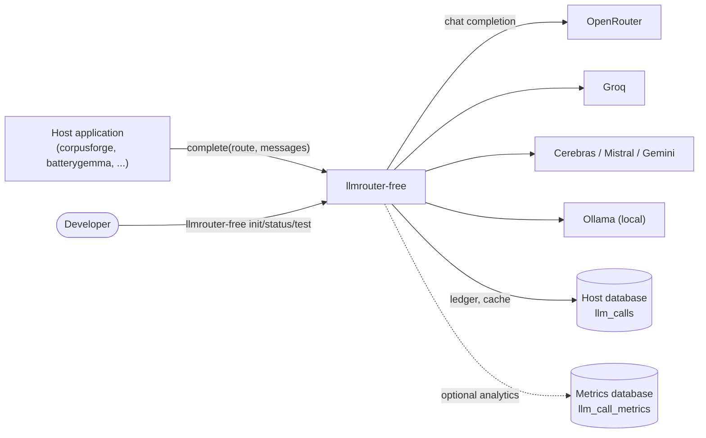

# 3 Context and scope

## 3.1 Business context

| Partner | Inbound | Outbound |
|---|---|---|
| Host application | `complete()`, `status()`, config | `LLMResult` or `AllDeploymentsExhausted` |
| LLM providers (via LiteLLM) | HTTP responses, errors | chat-completion requests |
| Host database | - | ledger rows; reads for cache and daily counts |
| Metrics database (optional) | - | one analytics row per attempt |
| Developer (CLI) | commands | tables, one live test response |

## 3.2 Technical context
- Provider access is entirely through `litellm.completion(**kwargs)`; the `completion_fn` constructor argument replaces it in tests.
- Provider keys come from `os.environ` at call time (so tests can `monkeypatch.setenv`).
- Persistence goes through a caller-supplied SQLAlchemy `Engine`.

## 3.3 Scope
**In**: routing, rate-limit accounting, cooldowns, retry policy, cache, ledger, output validation helpers, local-context sizing, small CLI.
**Out**: prompt design, response parsing beyond JSON validation, embeddings, streaming, async, running as a network proxy.
