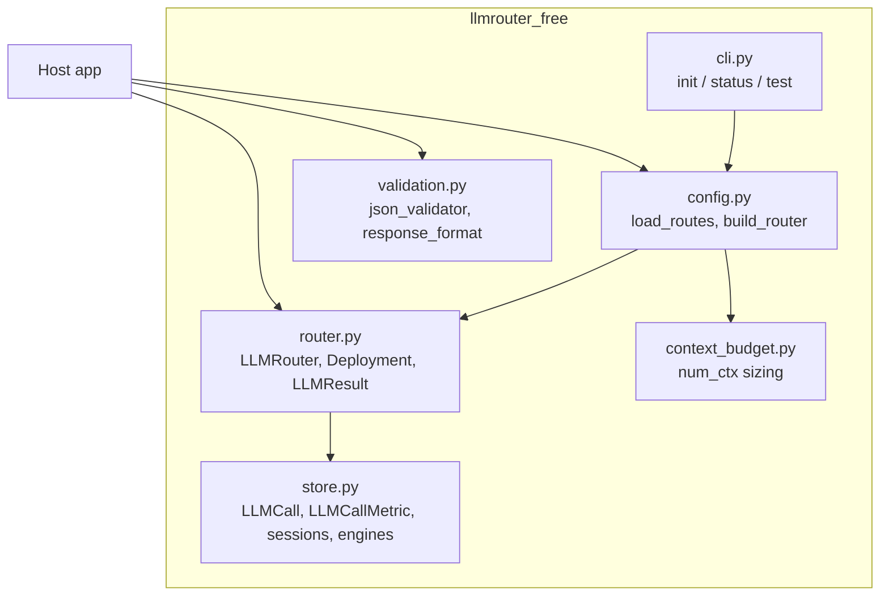

# 5 Building block view

## 5.1 Level 1 - the package

| Block | Responsibility | Depends on |
|---|---|---|
| `router.py` | Deployment selection, attempt execution, outcome classification, cooldowns, retry policy, cache lookup, `status()` | `store` |
| `store.py` | ORM models for the ledger (`llm_calls`) and analytics (`llm_call_metrics`); engine helpers (`register_sqlite_pragmas`, `make_ephemeral_engine`); `record_llm_call_metric` | SQLAlchemy |
| `validation.py` | `json_validator` (fence stripping, schema check, garbled-object guard); `json_schema_response_format` | Pydantic |
| `context_budget.py` | Pure arithmetic for a static Ollama `num_ctx`; `TaskBudget` registry; `apply_global_num_ctx` | - |
| `config.py` | YAML loading, timeout scaling, `build_router` (optionally applying context sizing) | `router`, `context_budget` |
| `cli.py` | Typer commands over the above | `config`, `store` |

## 5.2 Level 2 - inside `router.py`
| Element | Role |
|---|---|
| `Deployment` | Dataclass mirroring one YAML entry; `enabled` (key present), `group` (rate group), `is_local`, `cost()` |
| `LLMRouter.complete` | Orchestrates the attempt loop across *phases* (normal, then optional same-family fallback) |
| `_next_deployment` | Locked selection + rpm-slot reservation; returns a deployment *or* how long until one frees up |
| `_attempt` | One provider call: kwargs assembly, exception classification, cooldown/disable bookkeeping, ledger + metric writes, cache-eligible result |
| `_cached` | Replays the newest valid `ok` row for the prompt hash, re-validated, honouring family/model exclusions |
| `_classify_error` | Maps LiteLLM exceptions to outcomes |
| In-memory state | `_cooldown_until`, `_disabled`, `_recent` (rpm windows) - all guarded by one `threading.Lock` |
