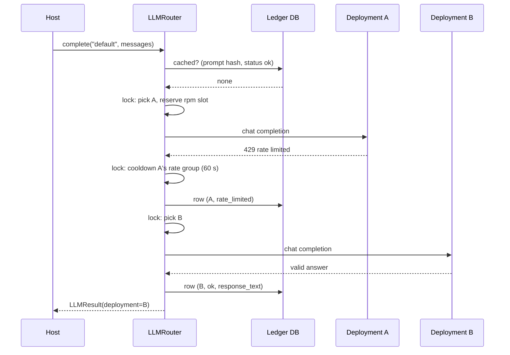

# 6 Runtime view

## 6.1 Scenario: normal call with failover

## 6.2 Scenario: transient error retries the reliable deployment first
1. A returns 503 -> outcome `error`, A gets an `error_seconds` cooldown.
2. Because `max_attempts_per_deployment` is 3 and A has used 1, the router clears A's cooldown and picks A again immediately (no fixed sleep).
3. After 3 failures A is excluded for this call and the router moves to B.

## 6.3 Scenario: invalid output
The provider returns HTTP 200 with `{"": "results"}`. `validate=json_validator(Model)` raises -> outcome `invalid_output`
-> retried like an error, and **not** written as a cache-eligible `ok` row, so it cannot be replayed later.

## 6.4 Scenario: everything is blocked
`_next_deployment` returns no deployment but a wait time (soonest cooldown/window expiry). If cumulative wait
stays within `max_wait_seconds`, the router sleeps and retries selection; otherwise it raises
`AllDeploymentsExhausted`. A *daily quota* cooldown (24 h) exceeds any sensible `max_wait_seconds`, so the call
fails fast instead of blocking a worker for a day.

## 6.5 Scenario: concurrent callers
Eight threads call `complete()` on one router. Selection is serialized (microseconds); each thread then holds
its own reserved slot and performs its network call in parallel. Ledger writes each use a fresh session.
