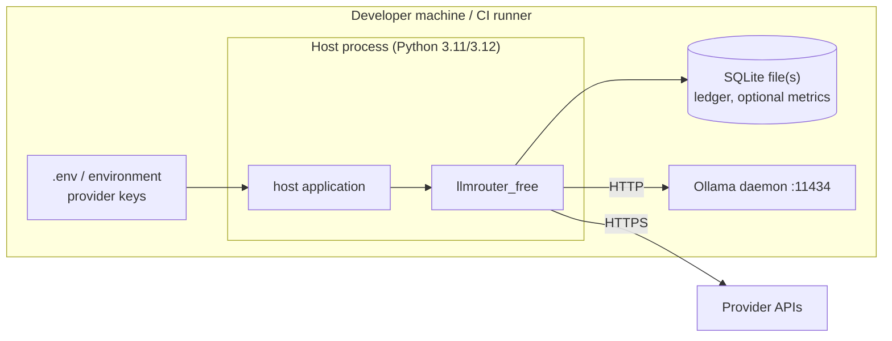

# 7 Deployment view

`llmrouter-free` is a library: it runs *inside* the host process. There is no server to deploy.

| Concern | Choice |
|---|---|
| Distribution | `pip install git+https://github.com/fredbuildsai/llmrouter-free.git@<tag>`; PyPI later |
| Configuration | One YAML file + environment variables; `llmrouter-free init` scaffolds it |
| Storage | SQLite file with WAL and a 30 s busy timeout (via `register_sqlite_pragmas`); any SQLAlchemy engine works |
| Default storage | Private temp-file SQLite when no engine is given (removed at exit) |
| CI | GitHub Actions: lint + tests on Python 3.11 and 3.12 |
